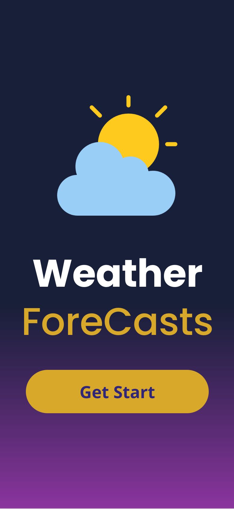
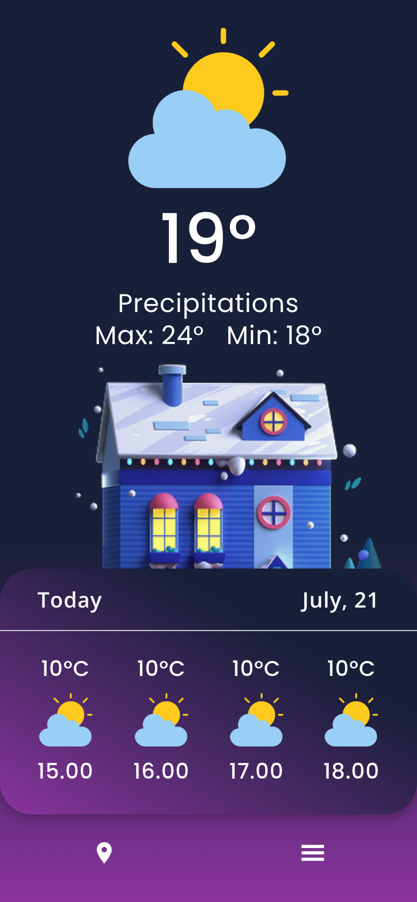
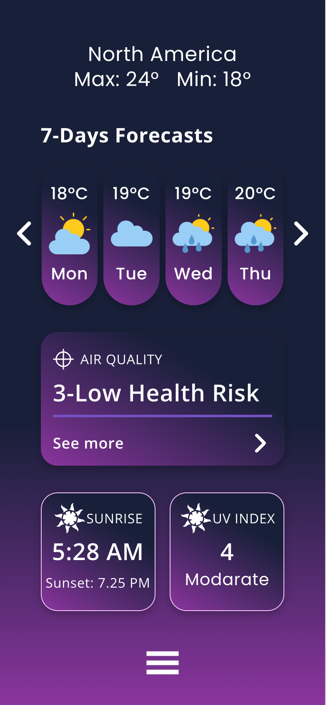
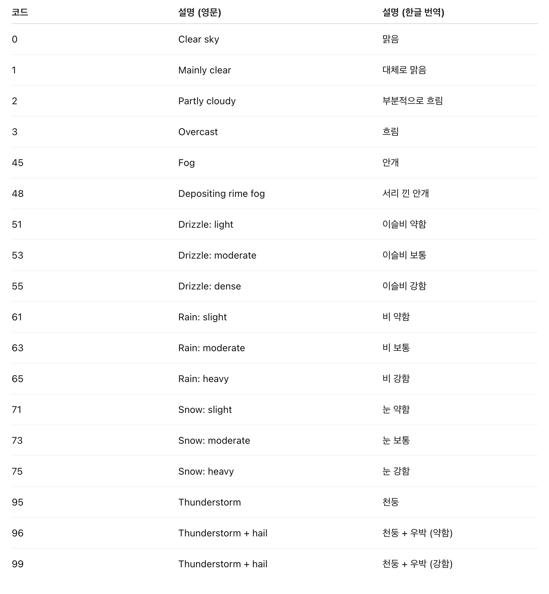
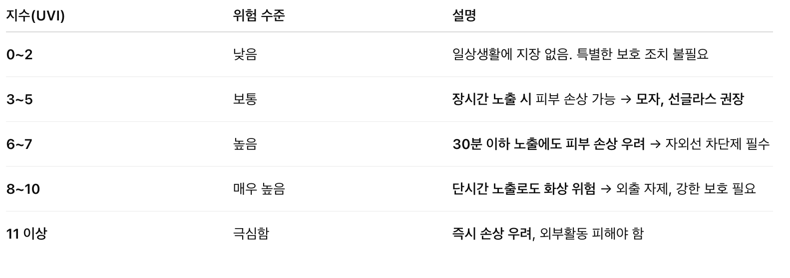
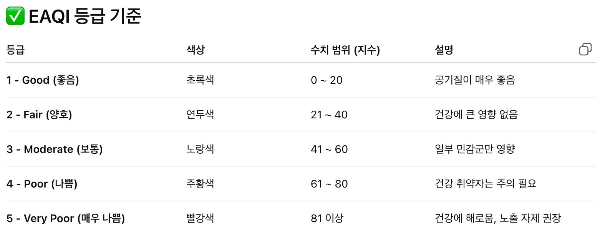

# 간단한 날씨 웹앱 만들기

## 구성 화면
### 인트로 화면


### 메인 화면


### 상세 화면


## 이슈
### 위치 정보 불러올 수 없음
```text
GeolocationPositionError {code: 2, message: 'Position update is unavailable'}
```
- 위치 정보 접근 권한 부여시에도 위치 정보를 불러올 수 없음.
- localhost 환경이라 정상적으로 동작하지 않는 것으로 추측됨.
- 일시적인 오류였던 걸로 파악됨.

### 페이지 이동 시 Recoil 값 초기화됨
```javascript
<CommonIconButton icon={MdLocationOn} onClick={() => {window.location.href = '/main';}} size="40px" />
<CommonIconButton icon={GiHamburgerMenu} onClick={() => {window.location.href = '/detail';}} size="40px" />
```
- 페이지 이동 시 window.location.href를 사용하였는데 해당 부분때문에 문제가 발생함.
- 자바스크립트로 페이지를 강제로 새로고침시키는 명령. 이는 일반 \<a> 태그를 클릭하는 것과 동일하게 동작하여 페이지 전체를 처음부터 다시 불러옴.
- 결과적으로, 현재 페이지의 모든 JavaScript 메모리가 사라지므로 Recoil 상태 역시 default 값으로 초기화됨.
```javascript
import {useNavigate} from "react-router-dom";

const navigate = useNavigate();

<CommonIconButton
    icon={MdLocationOn}
    onClick={() => navigate('/main')}
    size="40px"
/>
<CommonIconButton
    icon={GiHamburgerMenu}
    onClick={() => navigate('/detail')}
    size="40px"
/>
```

### open-meteo 날씨 코드


### 자외선 정보


### 공기질 정보


## 해당 프로젝트 평가
- 해당 프로젝트는 React 재학습 용도로 사용하였음.
- Flutter 프로젝트를 전부터 오랜기간 진행해 왔기 때문에 Flutter의 화면 구현 방식을 많이 차용하려고 했음.
- 컴포넌트를 만들고 진행을 하면서 좋았던 점은 후반부 갈수록 개발 속도가 굉장히 빨라짐.
- 만들면서 가장 아쉬웠던 컴포넌트는 Row 컴포넌트가 가장 아쉬움.
- 왜 아쉽냐면 width를 따로 지정해주어야 된다는 점이 불편했음. Flutter 방식이었다면 Row에 width는 없음.
- Row에 OnClick 이벤트를 추가한 부분도 아쉬움. 차라리 새로운 컴포넌트를 생성하는게 나을 것.
- Text 관련 컴포넌트들은 컴포넌트명 짓는게 어려웠음. 특히 폰트 두개가 혼재되어 이름 짓기가 더 어려웠음.
- Padding 컴포넌트를 생성 하려다 말았는데 Row와 Column 컴포넌트가 생각한대로 정상 작동 했다면 추가해볼만 할듯.
- open-meteo에서 제공하는 API의 질이 생각보다 괜찮아서 놀랬음.

### MainPage 코드 구조
```javascript
return (
    <ThemeProvider theme={theme}>
        <MainWrapper>
            <CommonSpacing size={'16px'} />
            <WeatherImage size={'150px'} weatherCode={weather.currentWeather.weathercode} />
            <CommonText fontWeight={'500'} letterSpacing={'0.47px'} fontSize={'64px'}>{weather.currentWeather.temperature}°C</CommonText>
            <CommonText lineHeight={'1.0'}>Precipitations</CommonText>
            <CommonText text={''}>Max: 24° Min: 18°</CommonText>
            <CommonImage src={"/images/house.png"} size={'340px'} />
            <FullWidthContainer height={'230px'}>
                <Row mainAxisAlignment={'space-between'} px="35px" py="15px">
                    <ContentText fontWeight={'600'} fontFamily={`"Open Sans", sans-serif`}>Today</ContentText>
                    <ContentText fontWeight={'600'} fontFamily={`"Open Sans", sans-serif`}>{getFormattedToday()}</ContentText>
                </Row>
                <DefaultDivider />
                <Row mainAxisAlignment={'space-between'} pt="20px">
                    {weather.nextFourHoursWeather.map((item) => (
                        <Column crossAxisAlignment={'center'}>
                            <ContentText fontWeight={'500'}>{item.temp}°C</ContentText>
                            <CommonSpacing size={'8px'} />
                            <WeatherImage size={'50px'} weatherCode={item.weathercode} />
                            <CommonSpacing size={'8px'} />
                            <ContentText text={item.time} fontWeight={'500'}>{item.time}</ContentText>
                        </Column>
                    ))}
                </Row>
            </FullWidthContainer>
            <CommonSpacing size={'16px'} />
            <Row mainAxisAlignment={'space-around'} width={'100%'} >
                <CommonIconButton icon={MdLocationOn} onClick={() => navigate('/main')} size="40px"/>
                <CommonIconButton icon={GiHamburgerMenu} onClick={() => navigate('/detail')} size="40px"/>
            </Row>
        </MainWrapper>
    </ThemeProvider>
);
```


## 참고
- 디자인: https://www.figma.com/community/file/1264522121969062318/weather-app
- Poppins 폰트: https://fonts.google.com/specimen/Poppins?query=POPPINS
- Open Sans 폰트: https://fonts.google.com/specimen/Open+Sans
- 이미지: https://www.flaticon.com
- 아이콘: https://react-icons.github.io/react-icons
- 날씨 데이터: https://open-meteo.com/en/docs
- 공기질 데이터: https://open-meteo.com/en/docs/air-quality-api